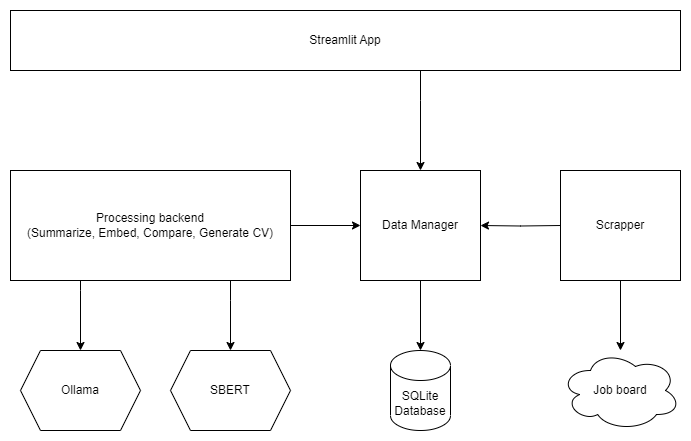

# CV-inator

Your local, private, AI-powered job search assistant.

## Key Features

- Smart offer matching – Find job listings aligned with your preferences using semantic similarity (powered by SBERT and local LLMs),
- AI-generated, tailored CVs – Automatically create personalized CVs matched to specific job offers,
- Full privacy – No data is ever sent to external servers. All models run locally on your CPU or GPU,
- Model flexibility – Choose different models based on your hardware capabilities,
- Offline mode – Works 100% offline after scraping offers and downloading required models.

## How It Works

Job offers are first summarized using a local Large Language Model (LLM), guided by a specialized prompt that extracts key elements such as job description, required skills & tech stack, responsibilities, benefits.

Each long-text field is then embedded using SBERT. During search, the similarity score between offers is calculated based on:

- Weighted embedding similarity of long-text fields (e.g., descriptions)
- Set-based similarity for structured fields (e.g., tech stack)
- Optional user-defined filters for more precise targeting

When generating a CV, the tool uses your previously provided profile data, combines it with the selected job offer, and uses a local LLM to iteratively craft a relevant, truthful, and visually appealing HTML-based CV.



## installation

Before running the app, make sure to install the following dependencies:

1. Install python packages: [Pytorch](https://pytorch.org/get-started/locally/), [Jinja2](https://jinja.palletsprojects.com/en/stable/), [streamlit](https://streamlit.io/)

2. Install [Ollama](https://ollama.com/), a local LLM server.

3.  install [SBERT](https://sbert.net/), a Sentence Transformers module for generating sentence embeddings and calculating similarity scores.

tested with ONNX version:

```
pip install -U "sentence-transformers[onnx-gpu] @ git+https://github.com/UKPLab/sentence-transformers.git"
```

4.  install local cv-inator packages

in the root project dir:

```
pip install -e cvinatordatamanager
pip install -e cvinatorprocessingtools
```

5. Optionally, for a scraping functionality: [selenium](https://selenium-python.readthedocs.io/), [BeautifulSoup](https://pypi.org/project/beautifulsoup4/)

## Usage

The main functionality is available via the Streamlit web app, but first, you’ll need to provide some job offers.

### Populate the database

Offers should be provided as a JSON file or multiple JSON files. Each file should contain a list of offers. The offer format is not strictly specified, but it should include as much information as possible. The system will automatically extract the relevant fields and format them accordingly.

One way to build a JSON file with job offers is to use the web scrapers provided with this tool (see the Scrapers section).

To load job offers into the database and process them, use the cmd_tools\prepare_data.py tool (use the -h option to see available parameters).

### Launch the Web App

run `streamlit offers-compare-tool\run app.py`

### Scrapers

#### Automated scraper

*Currently the only supported job board is [theprotocol.it](https://theprotocol.it/)*

1. run `python .\scrapers\scraper_theprotocol\scraper.py -n <number_of_offers> -o <output_file>`

#### Manual scraper

*Currently the only supported job board is [theprotocol.it](https://theprotocol.it/)*
1. Install scraper-ext as a extension in your favourite web browser (tested in firefox and chrome)
2. Go to one of the supported job boards, select the offer, click 's'
3. Scrapped offer is now in your clipboard
